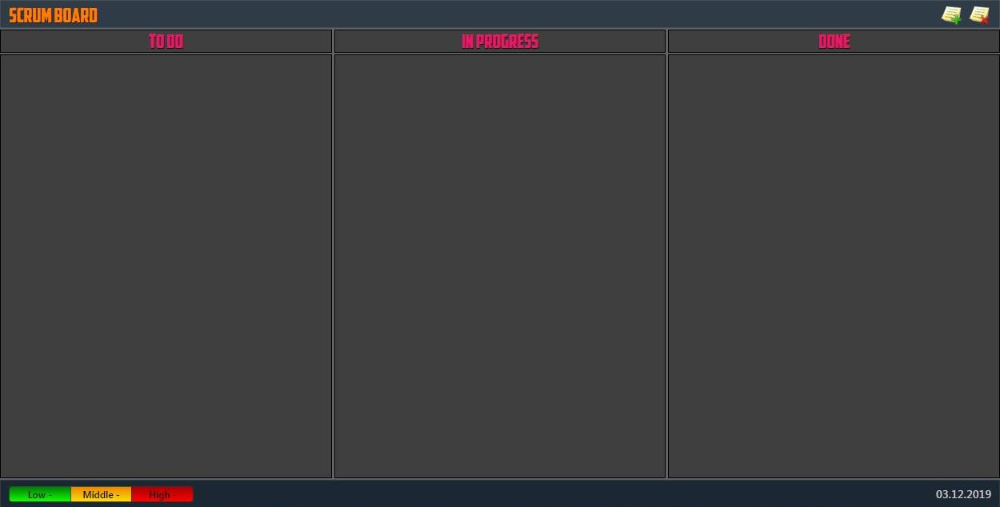
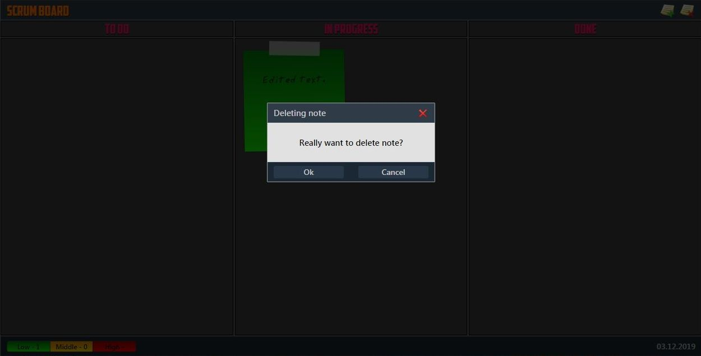

# SCRUM-Board

SCRUM-Board - приложение для создания задач (заметок), отслеживание их выполнения и хранения в LocalStorage браузера.

Для создания задачи необходимо нажать кнопку "Create note", после чего появляется окно создания задачи. В окне создания можно выбрать приоритет задачи и ввести ее текст:

После создания задачи заметка добавляется на доску в раздел "To Do":

При наведении указателя мыши на заметку на ней появляются кнопки удаления "Delete note" и редактирования "Edit note":

Заметку можно перенести в другие разделы доски с помощью способа Drag-and-drop, при этом раздел, в который можно переместить заметку, подсвечивается:

При нажатии на кнопку "Edit note" появляется окно редактирования задачи:

Результат изменений отображается на доске:

Для удаления заметки необходимо подтвердить свои действия в появляющемся окне:

